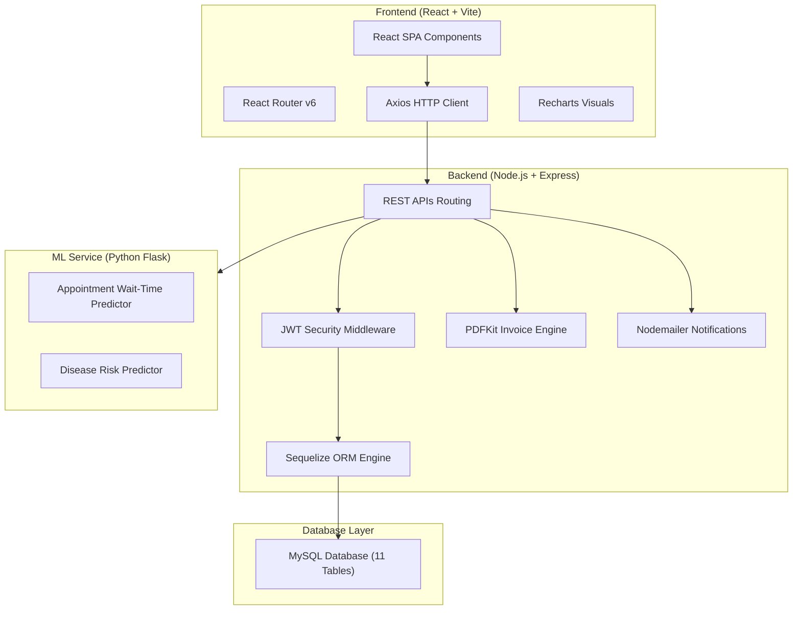

# Premium Hospital Management System (HMS)

A complete, full-stack Hospital Management System designed for clinical operations, appointment scheduling, billing invoices generation, security auditing, and machine learning prediction tasks.

## 🏗️ System Architecture



---

## 🛠️ Setup Instructions

### Prerequisites
- **Node.js**: v18.0.0 or higher
- **MySQL Server**: running locally on port `3306` (or configured otherwise)
- **Python**: v3.8+ (optional, for ML microservices)

---

### Step 1: Database Setup
1. Open your MySQL client and run the following command to create the database:
   ```sql
   CREATE DATABASE hospital_mgmt;
   ```
2. Import the schema template:
   ```bash
   mysql -u root -p hospital_mgmt < server/db/schema.sql
   ```

---

### Step 2: Environment Setup
Copy the `.env.example` file to `.env` in the root directory:
```bash
cp .env.example .env
```
Adjust credentials (such as DB password, JWT secrets, SMTP setups) inside `.env`.

---

### Step 3: Backend Setup & Seed Data
1. Install dependencies inside the `server/` directory:
   ```bash
   npm run install:server
   ```
2. Run database seeds to pre-populate departments, doctors, and patients:
   ```bash
   npm run seed
   ```
3. Start the Express server:
   ```bash
   npm run server
   ```
   The backend server runs on: **`http://localhost:4000`**

---

### Step 4: Frontend Setup
1. Install dependencies inside the `client/` directory:
   ```bash
   npm run install:client
   ```
2. Start the Vite React app:
   ```bash
   npm run client
   ```
   The React SPA will start on: **`http://localhost:5173`**

---

### Step 5: ML Microservice Setup (Optional)
1. Navigate to the `ml-service` directory:
   ```bash
   cd ml-service
   ```
2. Install Python requirements:
   ```bash
   pip install -r requirements.txt
   ```
3. Start the Flask server:
   ```bash
   python app.py
   ```
   The ML service will run on: **`http://localhost:5001`**

---

## 🔑 Default Credentials

Use the following seeded accounts to verify different roles:

| Role | Email | Password |
| :--- | :--- | :--- |
| **System Administrator** | `admin@hospital.com` | `admin123` |
| **Clinical Specialist (Doctor)** | `dr.smith@hospital.com` | `doctor123` |
| **Receptionist Desk** | `reception@hospital.com` | `reception123` |
| **Patient Profile** | `john.doe@hospital.com` | `patient123` |

---

## 🌟 Key Features

1. **User Authentication**: Role-based access security using JSON Web Tokens (JWT) stored in LocalStorage.
2. **Clinical Queue Manager**: Prevent double-booking conflicts and run real-time appointment validation checkins.
3. **ML-Assisted Diagnoses**: Predict diseases based on active symptom flags directly within the patient profile view.
4. **PDF Invoice & Payments Ledger**: Auto-generates branded invoices using PDFKit, track partial payments, and calculate taxes/discounts dynamically.
5. **Security Audit Trails**: Log every administrative modification (CREATE, UPDATE, DELETE) to a tamper-proof database log.
